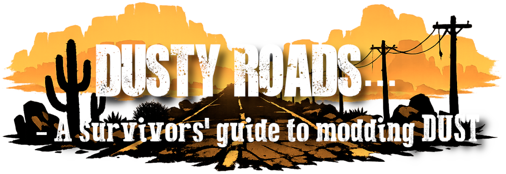

# WELCOME SURVIVOR...

<a href="https://www.nexusmods.com/newvegas/mods/97094" target="_blank">Nexus</a> | <a href="https://discord.gg/AJxH6mFTnE" target="_blank">Discord</a> | <a href="https://loadorderlibrary.com/lists/dusty-roads" target="_blank" style="color: #14b750;">Load Order Library</a> | <a href="https://www.reddit.com/r/fodust/" target="_blank" style="color: #ff4500;">Reddit</a>

  

    "There was nowhere to go but everywhere, 
    so just keep wandering through the dust."
	 
	- John Kerouac (presumably eaten by cannibals)
  

## The Guide

This guide aims to help you set up a stable Fallout New Vegas experience built around DUST Survival Simulator, incorporating stability and performance improvements that have stood the test of time.

<b>What not to expect:</b>

<ul>
  <li>Tactical overhauls;</li>
  <li>Slooty outfits;</li>
  <li>Bazillion additional weapons;</li>
  <li>Ultra-high-resolution textures for every inch of the Mojave.</li>
</ul>

No, the focus is a solid DUST foundation, with a small number of thematic additions to enhance the experience. From there, you’re free to expand as you see fit. But beyond this point you’re on your own on your slow descent into insanity. Know when to <em>Let Go</em>...

## Using the Guide

Take your time, read the guide in full and avoid skipping steps. If you need support with following the guide, or with your modded game, you can open a support ticket on the <a href="https://discord.gg/AJxH6mFTnE" target="_blank">DUST Discord</a> (<code>#support-and-bugs-dust</code>), but it’s expected that you’ve followed the instructions carefully and done your due diligence before asking for help. 
 
Each mod’s requirements and dependencies are accounted for. When a mod lists requirements on its download page, they are either already covered elsewhere in the guide or will be addressed later. Some may be recommendations rather than strict requirements, and may be omitted if not considered necessary. If a required dependency is not already included in the guide, it will be explicitly listed for download at the relevant step. 
 
The mod manager of choice is Mod Organizer 2. Though that does not mean you cannot follow the guide as a Vortex user, but you'll have to rely on other sources of information to set up Vortex, or how to install and deploy mods. 
 
If you choose to add additional mods, always read their descriptions, instructions, and requirements. You may need to revisit earlier installations to enable compatibility options or install additional patches.

## Credits

<ul>
  <li><a href="https://vivanewvegas.moddinglinked.com/index.html" target="_blank">Viva New Vegas</a>, the long-standing benchmark for reliable modded FNV setups, and inspiration and example for this guide;</li>
  <li><a href="https://www.nexusmods.com/profile/Redawt" target="_blank">Red</a>, for leading by example with his <a href="https://redawt.github.io/BelowZeroGuide/" target="_blank">Below Zero</a> guide for FROST Survival Simulator;</li>
  <li><a href="https://www.nexusmods.com/profile/theSnort" target="_blank">theSnort</a> and <a href="https://www.nexusmods.com/profile/Grimpup" target="_blank">Grimpup</a> for support, motivation and <a href="https://www.nexusmods.com/newvegas/mods/91012" target="_blank">Ink & Ash</a>;</li>
  <li>The Council of the DUST Discord for support and ideas;</li>
  <li>The active and lively user base over at the DUST Discord;</li>
  <li>And last but not least, the storyteller extraordinaire, <a href="https://www.nexusmods.com/profile/naugrim04" target="_blank">naugrim04</a>, for DUST Survival Simulator, a mod that fundamentally changed what Fallout New Vegas could be!</li>
</ul>